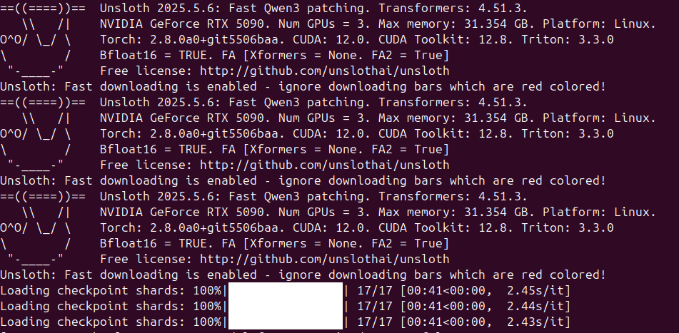
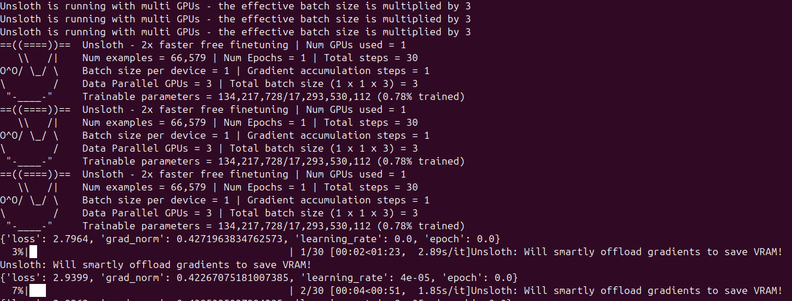
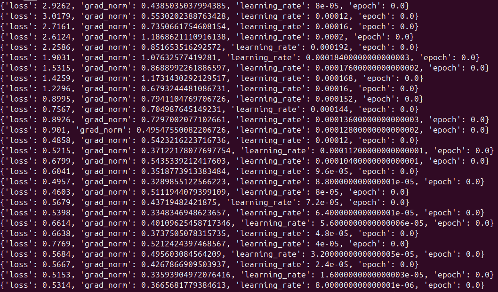

# Unsloth Docker for RTX 5000 Series (SM\_120 / Compute 12.0)



## 📦 Description

A prebuilt Docker container with:

* ✅ **Patched Unsloth** and **Unsloth Zoo**
* ⚡ **Precompiled PyTorch 2.8.0**, FlashAttention 2.7.4, Triton, and Accelerate
* 🚀 Full support for RTX 5000 series GPUs (e.g., RTX 5090) with **Compute Capability 12.0 (SM\_120)**

Ideal for multi-GPU fine-tuning and inference.

---

## ✅ Tested On

* 🖥️ **GPU:** 3× NVIDIA RTX 5090
* 🐧 **OS:** Ubuntu 24.04.2 LTS
* 🧠 **Kernel:** `6.11.0-25-generic`

---

## 🐳 Docker Image

- 📦 **Image Name:** `rgilbreth/rtx-5xxx-unsloth-training`  
- 🔗 **Docker Hub:** [View on Docker Hub ›](https://hub.docker.com/r/rgilbreth/rtx-5xxx-unsloth-training)  
- 📥 **Pull Command:**
- 💾 **Container Size:** ~18GB (compressed) | ~30GB (uncompressed)

```bash
docker pull rgilbreth/rtx-5xxx-unsloth-training
```

---





---

## 📁 File Structure

<summary><strong>📜 Scripts</strong></summary>

* `unsloth_Accelerate.py`
  Enables multi-GPU training via `accelerate` and `unsloth`, tailored for RTX 5000 cards.

* `unsloth_Accelerate-Docker.py`
  Docker-specific variant with environment assumptions preconfigured.

<summary><strong>ℹ️ Info Files</strong></summary>

* `Link-to-Docker-Image.md`
  Points to the standalone Docker image (includes all prebuilt `.whl` wheels).

* `venv.lock`
  Captures the exact Python environment used to build this Docker image.

<summary><strong>📂 Source Material</strong></summary>

* `unsloth/`
  Patched source for `unsloth` and `unsloth_zoo`.

* `docker/`
  Contains the Dockerfile and `requirements.txt` (no wheels bundled).

---

## 🐍 Installed Python Packages in Docker

<summary><strong>Click to expand full pip list</strong></summary>

```text
accelerate               1.7.0  
aiohappyeyeballs         2.6.1  
aiohttp                  3.11.18  
aiosignal                1.3.2  
argcomplete              3.1.4  
attrs                    23.2.0  
Babel                    2.10.3  
bitsandbytes             0.45.5  
blinker                  1.7.0  
certifi                  2025.4.26  
chardet                  5.2.0  
charset-normalizer       3.4.2  
click                    8.1.6  
colorama                 0.4.6  
configobj                5.0.8  
cryptography             41.0.7  
cut-cross-entropy        25.1.1  
datasets                 3.6.0  
dill                     0.3.8  
docstring_parser         0.16  
einops                   0.8.1  
filelock                 3.16.1  
flash_attn               2.7.4.post1  
frozenlist               1.6.0  
fsspec                   2024.10.0  
hf_transfer              0.1.9  
httplib2                 0.20.4  
huggingface-hub          0.31.4  
idna                     3.6  
Jinja2                   3.1.2  
jsonpatch                1.32  
jsonpointer              2.0  
jsonschema               4.10.3  
launchpadlib             1.11.0  
lazr.restfulclient       0.14.6  
lazr.uri                 1.0.6  
markdown-it-py           3.0.0  
MarkupSafe               2.1.5  
mdurl                    0.1.2  
mpmath                   1.3.0  
msgspec                  0.19.0  
multidict                6.4.4  
multiprocess             0.70.16  
netaddr                  0.8.0  
netifaces                0.11.0  
networkx                 3.4.2  
numpy                    2.1.2  
nvidia-cublas-cu12       12.8.3.14  
nvidia-cuda-cupti-cu12   12.8.57  
nvidia-cuda-nvrtc-cu12   12.8.61  
nvidia-cuda-runtime-cu12 12.8.57  
nvidia-cudnn-cu12        9.8.0.87  
nvidia-cufft-cu12        11.3.3.41  
nvidia-cufile-cu12       1.13.0.11  
nvidia-curand-cu12       10.3.9.55  
nvidia-cusolver-cu12     11.7.2.55  
nvidia-cusparse-cu12     12.5.7.53  
nvidia-cusparselt-cu12   0.6.3  
nvidia-nccl-cu12         2.26.5  
nvidia-nvjitlink-cu12    12.8.61  
nvidia-nvtx-cu12         12.8.55  
oauthlib                 3.2.2  
olefile                  0.46  
packaging                25.0  
pandas                   2.2.3  
peft                     0.15.2  
pexpect                  4.9.0  
pillow                   10.2.0  
pip                      25.1.1  
pipx                     1.4.3  
platformdirs             4.2.0  
propcache                0.3.1  
protobuf                 3.20.3  
psutil                   5.9.8  
ptyprocess               0.7.0  
pyarrow                  20.0.0  
Pygments                 2.17.2  
PyJWT                    2.7.0  
pyparsing                3.1.1  
python-dateutil          2.8.2  
pytorch-triton           3.3.0  
pytz                     2024.1  
pyxdg                    0.28  
PyYAML                   6.0.1  
regex                    2024.11.6  
requests                 2.32.3  
rich                     13.7.1  
safetensors              0.5.3  
sentencepiece            0.2.0  
setuptools               68.1.2  
shtab                    1.7.2  
six                      1.16.0  
sympy                    1.13.3  
tokenizers               0.21.1  
torch                    2.8.0a0+git5506baa  
torchaudio               2.6.0.dev20250514+cu128  
torchvision              0.22.0.dev20250514+cu128  
tqdm                     4.67.1  
transformers             4.51.3  
triton                   3.3.0  
trl                      0.15.2  
typeguard                4.4.2  
typing_extensions        4.13.2  
tyro                     0.9.20  
tzdata                   2025.2  
unsloth                  2025.5.6  (editable @ /app/unsloth)  
unsloth_zoo              2025.5.7  (editable @ /app/unsloth_zoo)  
urllib3                  2.0.7  
userpath                 1.9.1  
wadllib                  1.3.6  
wheel                    0.42.0  
xdg                      5.0.0  
xlrd                     2.0.1  
xxhash                   3.5.0  
yarl                     1.20.0  
```
